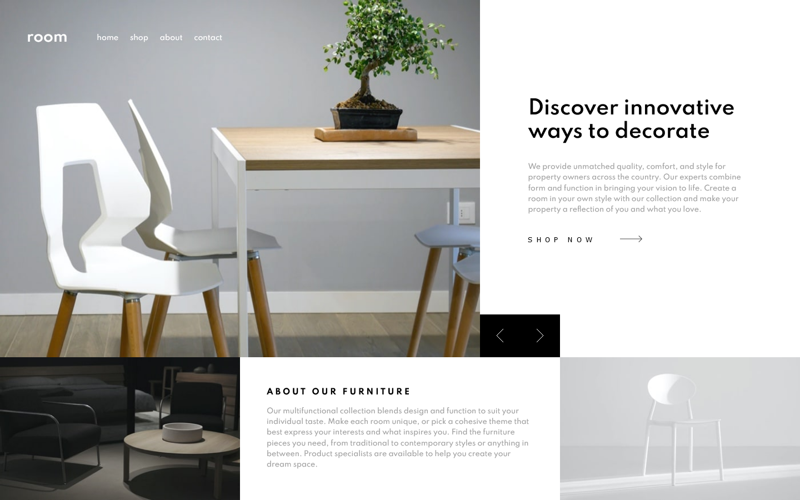

# Frontend Mentor - Room homepage solution

This is a solution to the [Room homepage challenge on Frontend Mentor](https://www.frontendmentor.io/challenges/room-homepage-BtdBY_ENq). Frontend Mentor challenges help you improve your coding skills by building realistic projects.

## Table of contents

- [Overview](#overview)
  - [The challenge](#the-challenge)
  - [Screenshot](#screenshot)
  - [Links](#links)
- [My process](#my-process)
  - [Built with](#built-with)
  - [What I learned](#what-i-learned)
  - [Continued development](#continued-development)
- [Author](#author)

## Overview

### The challenge

Users should be able to:

- View the optimal layout for the site depending on their device's screen size
- See hover states for all interactive elements on the page
- Navigate the slider using either their mouse/trackpad or keyboard

### Screenshot

### Links

- Solution URL: [Add solution URL here](https://your-solution-url.com)
- Live Site URL: [Add live site URL here](https://your-live-site-url.com)

## My process

### Built with

- Semantic HTML5 markup
- CSS custom properties
- CSS Grid
- SASS
- Javascript

### What I learned

It seemed an easy project at first, but then I realized that the best way to achieve the challenge was to use CSS Grid, which I didn't know.
So I decided to study is watching the tutorial from Wes Bos and reading the "Definitive CSS Guide" from CSS tricks.
I learned also how to choose the perfect img source depending on display size with the srcset attribute.
And lastly, I coded a simple but effective slider with Javascript.

I know this project it's far from perfect, but I put a lot of effort on It and I'm really proud of it, in particular for:

<ul>
  <li>Using for first time CSS Grid</li>
  <li>Using for first time SASS with modularity logic</li>
  <li>Creating by my hand a simple slider with JS</li>
</ul>

### Continued development

For the next project I want to practice with API data fetching and JS. More over, I will try to be more readable in writing my code, for example by writing HTML and CSS using BEM logic.

## Author

- Frontend Mentor - [@dimolf345](https://www.frontendmentor.io/profile/dimolf345)
- LinkedIn - [@LucaDiMolfetta](https://www.linkedin.com/in/luca-di-molfetta-89659419a/)
- Facebook - [@LucaDIMolfetta](https://www.facebook.com/Kuketto)
